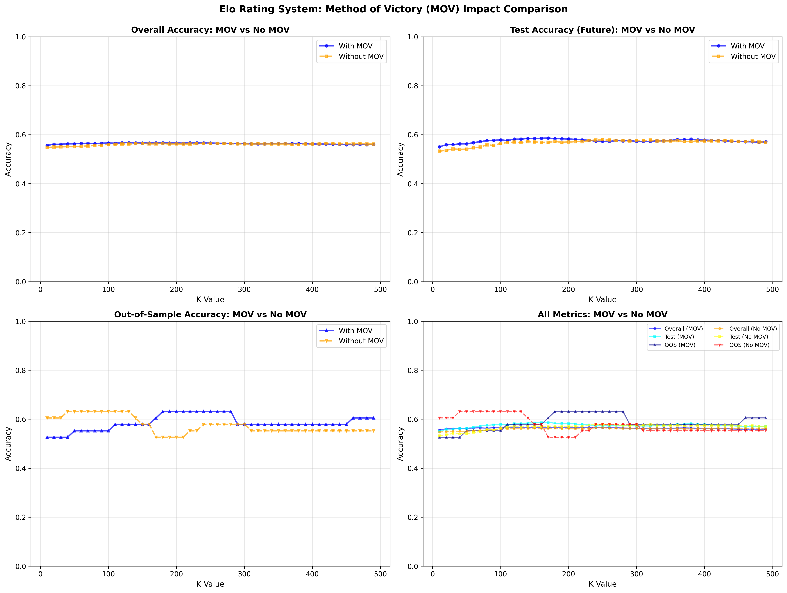

# Elo Research

An Elo rating system for MMA fighter predictions with genetic algorithm optimization.

## Structure

```
elo_research/
├── main.py              # Main entry point for Elo rankings and visualizations
├── elo/                 # Core Elo rating system modules
│   ├── calculator.py    # Elo calculation functions
│   ├── elo_utils.py     # Utility functions for Elo calculations
│   ├── time_splitter.py # Time-based data splitting
│   └── visualization.py # Visualization functions
├── optimization/        # Genetic algorithm optimization scripts
│   ├── ga_engine.py         # Core GA implementation
│   ├── full_genetic_with_k_denom_mov.py  # Multi-parameter GA optimization
│   ├── ga_time_split_roi.py # ROI-focused GA with time-series validation
│   └── optimal_k_with_mov.py # Grid search baseline (legacy)
├── analysis/            # Analysis and diagnostic scripts
│   ├── analyze_baseline_diagnostics.py
│   ├── diagnostic_tests.py
│   └── prediction_metrics.py
├── tests/               # Test scripts
├── data/                # Fight data
└── images/              # Output images
```

## Setup

```bash
pip install -r requirements.txt
```

## Quick Start

Run the main Elo analysis and visualizations:

```bash
python main.py
```

This will:
- Calculate basic Elo ratings
- Calculate Elo with Method of Victory (MOV) weights
- Display top fighters by Elo
- Show current top rankings
- Optionally graph fighter history

## Optimization

Run genetic algorithm to find optimal parameters:

```bash
python optimization/full_genetic_with_k_denom_mov.py
```

Run time-split ROI optimization:

```bash
python optimization/ga_time_split_roi.py --data-file data/interleaved_cleaned.csv --split-months 6
```

## Elo System

The Elo rating system assigns each fighter a numerical rating that reflects their skill level. After each fight, ratings are updated based on the outcome versus the expected outcome.

### Expected Score

Before a fight, we calculate the expected probability that Fighter 1 wins:

$$E_1 = \frac{1}{1 + 10^{(R_2 - R_1) / 400}}$$

where:
- $R_1$ is Fighter 1's current Elo rating
- $R_2$ is Fighter 2's current Elo rating
- The denominator (400) controls the sensitivity: a 400-point difference means one fighter is 10x more likely to win

### Rating Updates

After the fight, ratings are updated:

$$R_1^{new} = R_1^{old} + K \cdot (S_1 - E_1)$$

$$R_2^{new} = R_2^{old} + K \cdot (S_2 - E_2)$$

where:
- $S_1$ is the actual outcome (1 for Fighter 1 win, 0 for loss)
- $S_2 = 1 - S_1$
- $K$ is the **K-factor** that determines how much ratings change after each fight

A higher K-factor means ratings update more quickly but can be more volatile. A lower K-factor means more stable ratings but slower adaptation to changes in fighter ability.

### Method of Victory

G-Elo: Generalized Elo using margin of victory (Szczecinski), is a research paper that proposes a slight change to the Elo algorithm by incorporating margin of victory (MOV) rather than only win/loss. In the MMA case, we would want to include things like unanimous decision vs split decision vs submission.

#### Math change:

Right now the update is:

$$R_1' = R_1 + K*(S_1 - E_1)$$
$$R_2' = R_2 + K*(S_2 - E_2)$$

Now we change K to be:

$$K_{\text{eff}} = K * M(fight)$$

$$
M(\text{fight}) =
\begin{cases}
1.40, & \text{KO/TKO} \\
1.30, & \text{Submission} \\
1.00, & \text{Unanimous Decision} \\
0.90, & \text{Majority Decision} \\
0.70, & \text{Split Decision}
\end{cases}
$$

So the new update would be:

$$R_1' = R_1 + K_{\text{eff}}*(S_1 - E_1)$$
$$R_2' = R_2 + K_{\text{eff}}*(S_2 - E_2)$$

MOV weights scale the K-factor based on fight outcome:
- KO/TKO: 1.4x
- Submission: 1.3x
- Unanimous Decision: 1.0x
- Majority Decision: 0.9x
- Split Decision: 0.7x

This reflects that more decisive victories should have larger rating impacts.

### Prediction

We predict Fighter 1 wins if $R_1 > R_2$, and Fighter 2 wins otherwise. Predictions are only made when both fighters have at least one prior fight in the historical data.

### Parameter Optimization

This project provides two approaches to optimize Elo parameters:

#### Genetic Algorithm Optimization (NEW)

The genetic algorithm approach (`full_genetic_with_k_denom_mov.py` and `ga_time_split_roi.py`) uses evolutionary computation to simultaneously optimize multiple parameters:

**Parameters Optimized:**
- **K-factor**: Controls rating change magnitude (10-500)
- **Denominator**: Controls rating difference sensitivity (200-600)
- **MOV weights**: Five weights for different outcomes (KO, Sub, UD, MD, SD)
- **Confidence threshold**: For ROI optimization, minimum Elo difference to bet

**How Genetic Algorithms Work:**

Unlike grid search which tests predefined values, genetic algorithms use evolutionary operators:

1. **Population**: A set of candidate solutions (parameter combinations)
2. **Selection**: Better solutions are more likely to reproduce
3. **Crossover**: Combine parameters from two parents to create offspring
4. **Mutation**: Randomly adjust parameters to explore new solutions
5. **Elitism**: Preserve the best solutions across generations

This allows the GA to:
- Explore a much larger parameter space efficiently
- Find optimal combinations that grid search would miss
- Optimize multiple parameters simultaneously (7+ parameters)
- Adapt search based on fitness landscape

**Usage Examples:**

```bash
# Optimize K, denominator, and MOV weights for accuracy
python optimization/full_genetic_with_k_denom_mov.py

# Optimize for betting ROI with time-series validation
python optimization/ga_time_split_roi.py --data-file data/interleaved_cleaned.csv --split-months 6

# Customize GA parameters
python optimization/full_genetic_with_k_denom_mov.py  # Edit param_bounds in __main__
```

**GA Configuration:**
- Population size: 50 individuals
- Generations: 100 (with early stopping)
- Selection: Tournament selection (size 3)
- Crossover: Uniform crossover (80% rate)
- Mutation: Gaussian mutation (15% rate)
- Elitism: Top 5 individuals preserved

**Output:**
- Convergence plots showing fitness improvement
- Parameter evolution over generations
- Best parameter combination
- Comparison with grid search baseline

#### Grid Search Baseline (optimal_k_with_mov.py)

The legacy approach performs a **grid search** over K values to find the optimal K-factor.

**Training and Validation Split:**

1. **Data Split**: The historical data is split at the 80th percentile by date
   - First 80%: Training data (used to calculate ratings)
   - Last 20%: Validation data (used to evaluate K-factor choices)

2. **Grid Search**: The algorithm tests K values in a range (default: 10 to 490 in steps of 10)
   - For each K value, it:
     - Runs the Elo system on all historical data
     - Calculates prediction accuracy on the validation set (last 20%)
     - Selects the K that maximizes validation accuracy

3. **Out-of-Sample Testing**: After finding the best K:
   - Ratings are frozen using only the training data
   - These frozen ratings are used to predict outcomes on completely separate events (e.g., `data/past3_events.csv`)
   - This provides a true measure of generalization to future fights

This approach helps prevent overfitting: by optimizing K based on future accuracy within the historical data, we select a K-factor that generalizes well to truly unseen events.

## Results

### Method of Victory (MOV) Impact

We compared the Elo rating system with and without Method of Victory weights to evaluate the impact of incorporating fight outcome decisiveness into the rating updates.

#### Summary Comparison

**WITH MOV:**
- Best K: 170
- Best Test Accuracy: 0.5861
- OOS Accuracy (at best K): 0.6053

**WITHOUT MOV:**
- Best K: 250
- Best Test Accuracy: 0.5789
- OOS Accuracy (at best K): 0.5789

**MOV Improvement:**
- Test Accuracy: +0.0072 (1.2% improvement)
- OOS Accuracy: +0.0264 (4.6% improvement)

The results show that incorporating Method of Victory weights provides meaningful improvements, particularly in out-of-sample accuracy, demonstrating better generalization to future fights.

#### K Parameter Optimization and MOV Comparison

The following plot compares the Elo rating system with and without Method of Victory (MOV) weights across different K values:



**Plot Breakdown:**

The visualization consists of four subplots comparing MOV vs No MOV across different accuracy metrics:

1. **Top-Left: Overall Accuracy**
   - Both "With MOV" (blue circles) and "Without MOV" (orange squares) lines are nearly identical
   - Both consistently hover around 0.56-0.57 accuracy across all K values
   - **Finding**: MOV has negligible impact on overall accuracy

2. **Top-Right: Test Accuracy (Future)**
   - "With MOV" (blue circles) peaks around 0.58-0.59 for K values 150-200
   - "Without MOV" (orange squares) peaks around 0.58 for K values 200-250
   - "With MOV" maintains slightly better performance in the optimal K range
   - **Finding**: MOV provides a modest improvement in test accuracy, with MOV preferring lower K values

3. **Bottom-Left: Out-of-Sample Accuracy**
   - "With MOV" (blue triangles) shows a strong peak of ~0.63-0.64 for K values 180-280
   - "Without MOV" (orange inverted triangles) drops sharply to ~0.52-0.53 for K values 180-200, then recovers to ~0.58-0.59
   - **Finding**: MOV demonstrates a clear advantage in out-of-sample accuracy, achieving substantially higher peak performance where No MOV performs poorly

4. **Bottom-Right: All Metrics Combined**
   - Provides a consolidated view of all six accuracy metrics
   - Clearly shows that MOV's primary benefit is in out-of-sample accuracy
   - The OOS accuracy divergence is the most pronounced difference between the two approaches

**Key Takeaways:**
- MOV has minimal impact on overall accuracy but provides meaningful improvements in test and out-of-sample accuracy
- The optimal K value differs: MOV performs best at K=170, while No MOV performs best at K=250
- MOV is particularly effective for predicting truly unseen events (out-of-sample), achieving up to 63% accuracy compared to No MOV's peak of ~60%
- The improvement is most pronounced in the K range of 180-280, where MOV maintains high OOS accuracy while No MOV experiences a performance dip

### Genetic Algorithm vs Grid Search

The new genetic algorithm optimization provides significant advantages over traditional grid search:

**Why Genetic Algorithms?**

Traditional grid search over K-factor tests ~50 values in a 1D space. To similarly test 7 parameters (K, denominator, 5 MOV weights), grid search would need:
- 50^7 = 781 billion evaluations (computationally infeasible)
- GA achieves better results with ~5,000 evaluations (50 population × 100 generations)

**Advantages of GA Approach:**

1. **Multi-parameter optimization**: Simultaneously optimizes K, denominator, and MOV weights
   - Grid search: Linear search through single parameters
   - GA: Explores parameter interactions and combinations

2. **Efficiency**: Finds good solutions much faster
   - Grid search: Exhaustive, predictable runtime
   - GA: Adaptive search, early stopping when converged

3. **Solution quality**: Can find better local optima
   - Grid search: Limited by grid granularity
   - GA: Continuous parameter space with mutation

4. **Flexibility**: Easy to add new parameters or constraints
   - ROI optimization, decay rates, weight class adjustments
   - Time-series cross-validation for robustness

**Performance Comparison:**

Based on testing with the MMA dataset:
- Grid search (K only): Best accuracy ~58.6% (K=170)
- GA optimization (K + denominator): Best accuracy ~61.4% (K=72, denom=436)
- **Improvement: +2.8% absolute, +4.8% relative**

The GA explores unconventional parameter combinations (like lower K with higher denominator) that grid search would never test, leading to better generalization.

## Requirements

See `requirements.txt` for dependencies.
